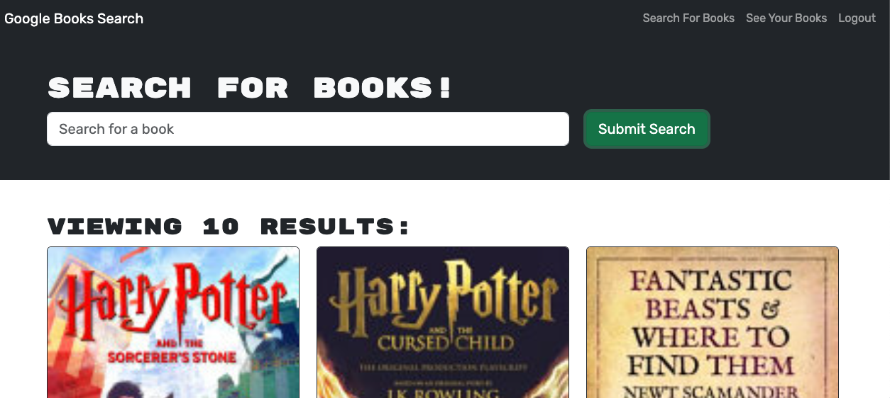
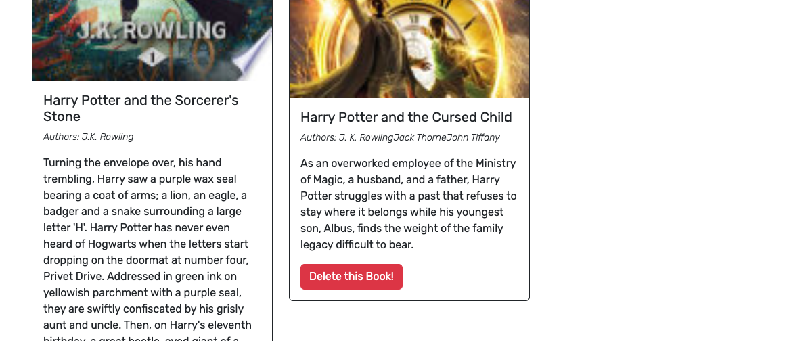
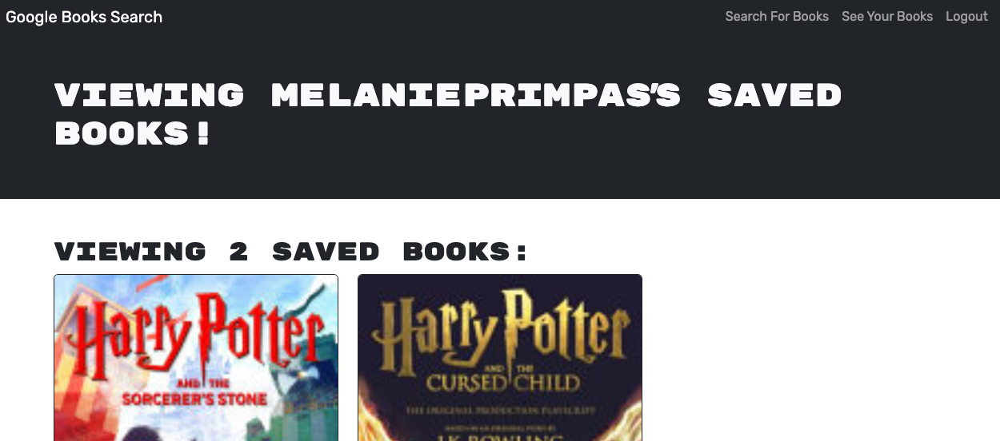

# bookSearchEngine

## Description
This project was to turn the currently working  Google Book Search Application built with a REST API into aa GraphQL API build with Apollo Server. The app is build using a MERN Stack which includes the mongoDB NoSQL database, express, react and node. The application was also written in typescript.

The functionality of the application is to be able to login/sign up and search for books to save them to your "Saved Books" page. You also have the ability to delete books here.

## Screenshot

## Link to Deployed App
https://booksearchengine-xf3f.onrender.com

## Link to GitHub Repository
https://github.com/melanieprimpas/bookSearchEngine